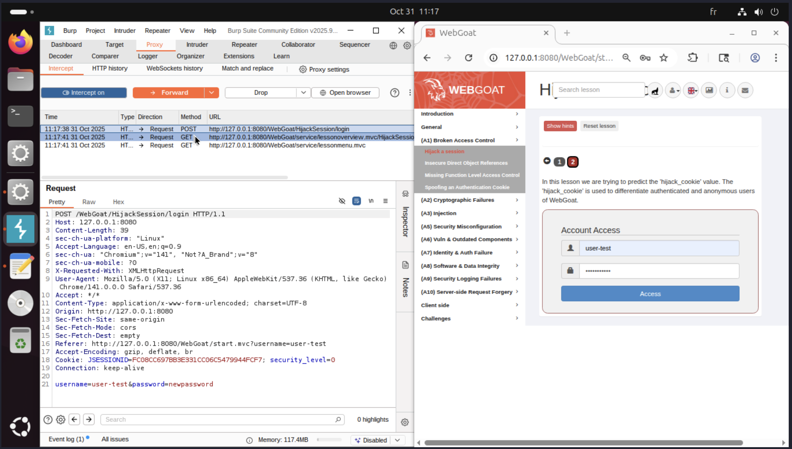
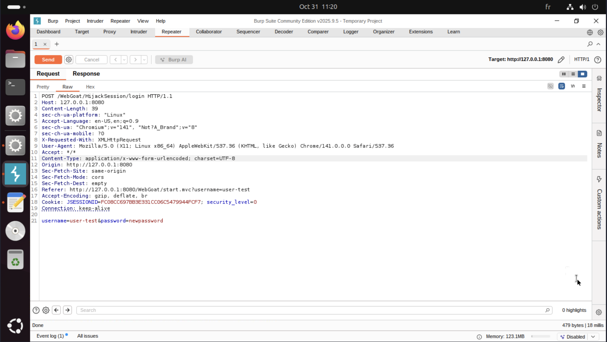
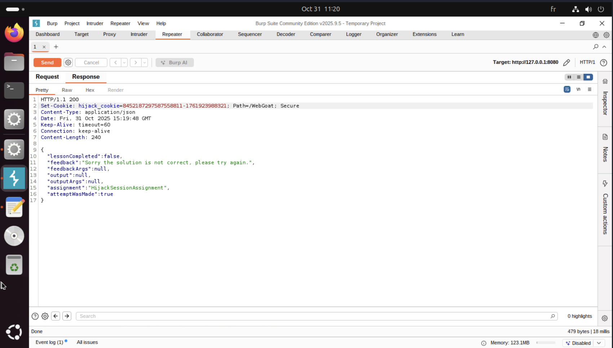
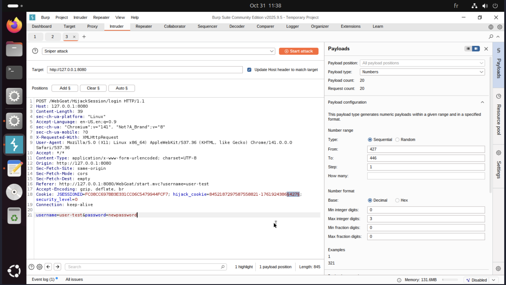
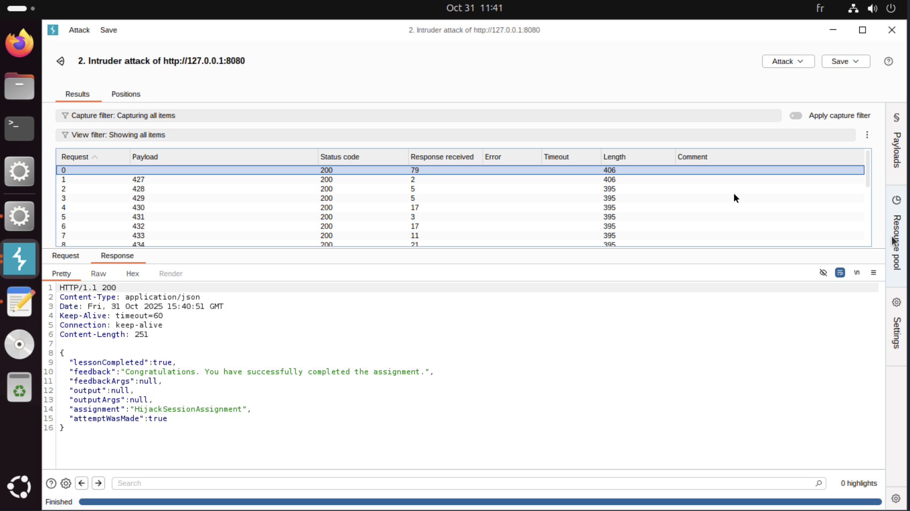
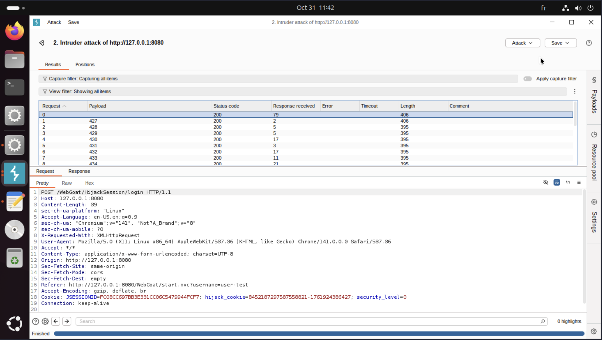
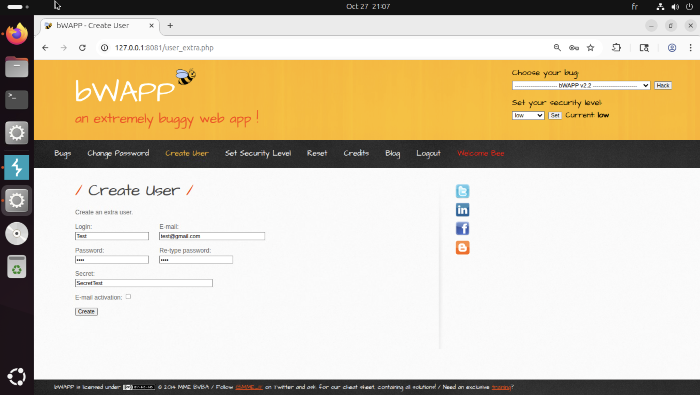
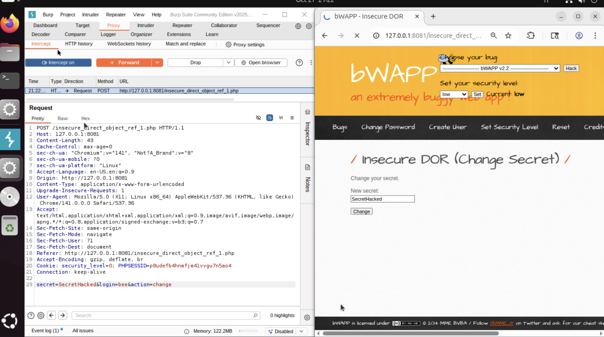
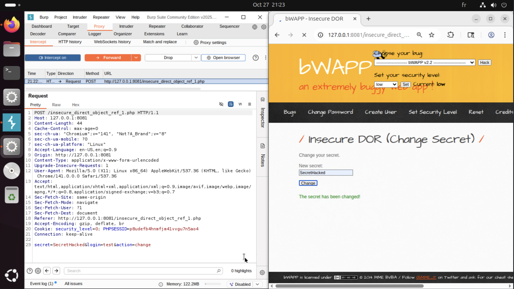
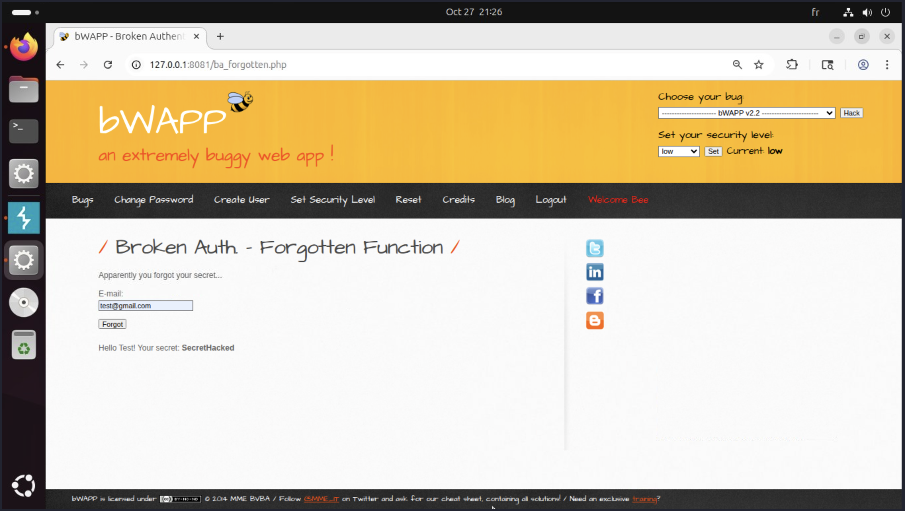

# Broken access control

## Présentation

## Test 1 — IDOR / modification d’un autre utilisateur (WebGoat)

On récupère la requête POST


On send la requête


Et dans la réponse on a l'hijack cookie 


Voici des exemples de cookies obtenus : 
 - 8452187297587558819-1761924367779
 - 8452187297587558820-1761924386427
 - 8452187297587558822-1761924400446

Le cookie ```8452187297587558820-1761924386427``` est séparé en deux partie, l'ID et le timestamp.
On remarque que lorsqu'on envoie plusieurs fois la requête, la partie ID s'incrémente de 1 mais des fois elle s'incrémente de 2.

Cela veut dire que quelqu'un a envoyé une requête entre nos requête. L'objetif va être de récupérer les informations de cette requête.

Pour cela, on envoie la requuête dans l'intruder, on ajoute le hijack cookie dans la section "Cookie", dans la partie id on modifie pour avoir l'ID du cookie qu'on recherche et on cherhce un timestamp entre le cookie précédent et le cookie suivant.



Avec l'une des requête nous avons le bon résultat :



Qui est obtenue grâce à la requête 



## Test 2 — IDOR / modification d’un autre utilisateur (bWAPP)

Objectif : vérifier si, connecté en tant que Test, on peut modifier le secret d’un autre utilisateur en changeant le paramètre de requête.

Preuve
- Création utilisateur Test :  
  

- Envoi de la requête de modification (param user ou uid) :  
  

- Modification du paramètre pour viser un autre compte et envoi :  
  

- Résultat : secret modifié pour l’autre compte :  
  


### Analyse
- L’application accepte un identifiant fourni par le client sans vérifier l’ownership ou les droits.
- Erreur de conception : contrôles d’accès object-level manquants.

### Remédiation
1. Toujours vérifier côté serveur que l’utilisateur courant est propriétaire ou a le rôle nécessaire avant lecture/modification.  
2. Centraliser la logique d’autorisation (middleware / fonction authorize).  
3. Logguer les accès refusés et envisager IDs non-prévisibles (UUID) en complément.

```php
session_start();
$current = $_SESSION['user_id']; // id connecté
$target = $_POST['user_id'] ?? null;

// récupérer $owner_id depuis la BDD pour la ressource ciblée
// exemple simplifié : $owner_id = get_owner_id($target);
if ($owner_id !== $current && $_SESSION['role'] !== 'admin') {
    http_response_code(403);
    echo "403 Forbidden";
    exit;
}
// sinon autoriser la modification
```

En tant que User A, le fait de tenter de modifier la ressource de User B fais que le serveur renvoie 403 et la ressource reste inchangée.


