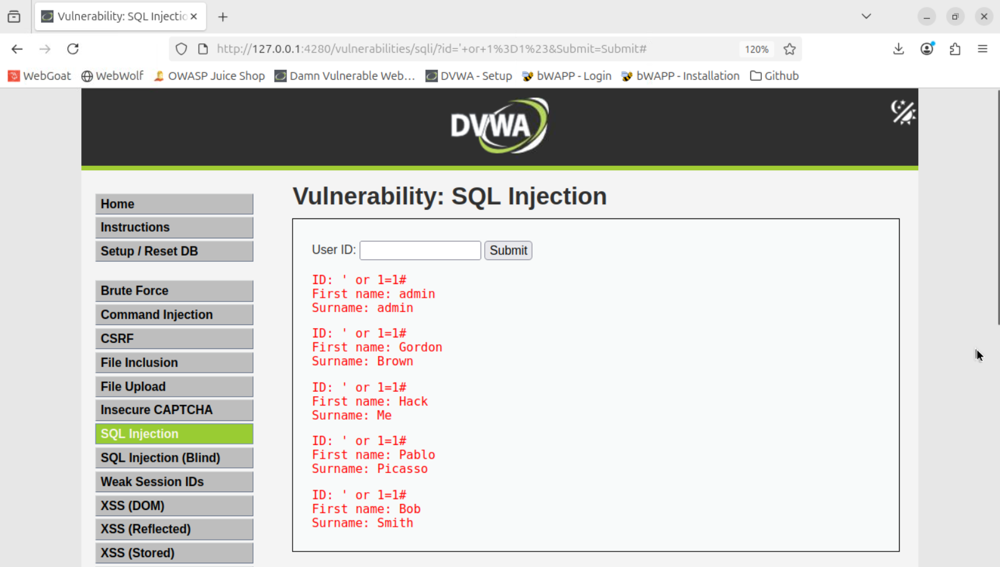
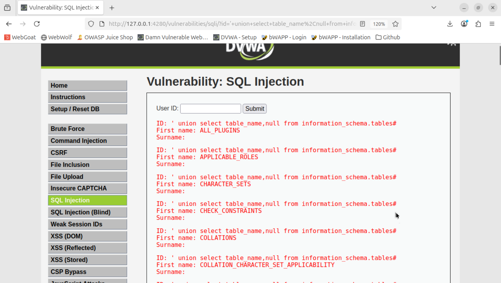
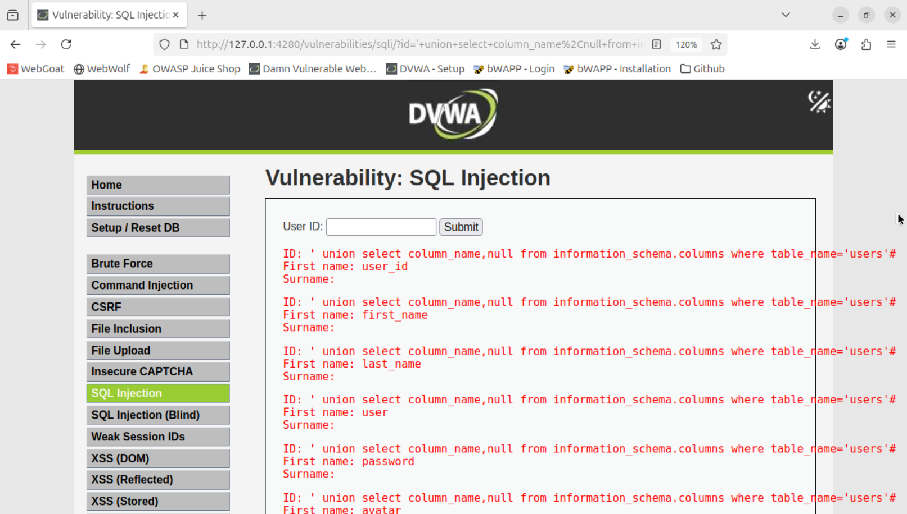
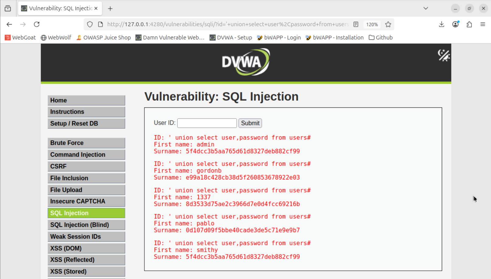

# Injection
## 1. Présentation du site

DVWA ...
User ID avec form -> texte à entrer

## 2. Injections

L'objectif est d'obtenir tous les mots de passe. Mais pour commencer simplement, on peut obtenir tous les utilisateurs.

### a. Injection pour avoir tous les noms d'utilisateurs

```' or 1=1#```



Le ```'``` permet de finir le ```id='```. Comme il est vide, ce sera faux, mais on va contourner en ajoutant ```or 1=1``` qui est toujours vrai. Enfin ```#``` va permettre d'ignorer les potentiels restrictions qui suivent.

Nous allons maintenat chercher les mots de passe. Malheureusement, nous ne connaissons pas l'architecture de la base de donnée. Nous allons donc commencer par chercher les tables.

### b. Injection pour obtenir tous les noms des tables

```' union select table_name,null from information_schema.tables#```



Nous avons à nouveau ```'``` et ```#``` et ils ont les même rôles que précédemment. Cependant, on fait un union avec une autre table, qui existe toujours et qui contient les noms des tables. Il apparait donc les différentes tables. On y remarque notemment la table ```users```. Il faut mettre ```,null``` car la fenêtre est sensée afficher ```First name``` et ```Surname```, donc 2 valeurs. Si on n'en récupérait qu'1, la fenêtre aurait crash.

### c. Injection pour obtenir tous les noms des colonnes d'une table précise

```' union select column_name,null from information_schema.columns where table_name='users'```



De la même manière, on obtient les différentes colonnes qui constituent la table ```users```. On remarque une colonne nommée ```password```. On va donc faire une dernière injection pour trouver les mots de passe.

### d. Injection pour obtenir tous les mots de passes

```' union select user,password from users#```



Nous avons finalement affiché les hashs des mots de passe des tous les utilisateurs. On reconnait l'encryptage MD5, peu sécurisé.

