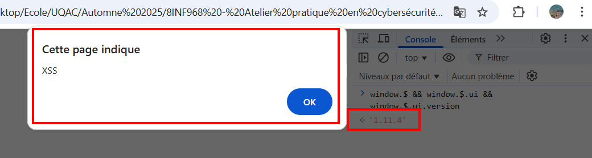

# A06:2021 — VULNERABLE AND OUTDATED COMPONENTS
**Définition (A06)**  
A06 concerne les risques liés à l’utilisation de composants logiciels vulnérables, obsolètes ou mal entretenus (bibliothèques, frameworks, modules, images conteneurs, OS, runtimes). Un composant vulnérable intégré à une application peut permettre à un attaquant d’exploiter une faille dans ce composant et d’obtenir un impact élevé (RCE, fuite de données, élévation de privilèges), même si le code applicatif lui-même est correct.

**Pourquoi c’est critique**

- Les composants tiers s’exécutent souvent avec les mêmes privilèges que l’application : une vulnérabilité dans une bibliothèque peut devenir une porte d’entrée complète.
- L’écosystème logiciel moderne est fortement dépendant : la plupart des applications importent des dizaines voire des centaines de dépendances directes et transverses (transitives).
- Les vulnérabilités peuvent être publiées après déploiement (CVE) et rester non corrigées longtemps si le processus de mise à jour est déficient.
- Certains composants sont abandonnés (unmaintained) : pas de patches fournis → exposition prolongée.

**Quelques données & contexte (illustratif)**

- Plus de 10 millions de dépôts sur GitHub.
- Environ 1 million de dépôts historiques sur SourceForge.
- Des milliers de dépôts binaires publics (artéfacts) sur divers registries.
Ces chiffres montrent l’ampleur et la fragmentation de l’écosystème open-source : beaucoup d’acteurs, de registres et de modèles de packaging coexistent, ce qui rend l’inventaire et le contrôle difficiles.

**Conséquences opérationnelles**

- Difficulté à inventorier toutes les dépendances (directes + transitives).
- Risque d’importer des paquets malveillants (typosquatting, malicious publish).
- Risque d’exécuter des binaires dont le code source ne correspond pas au binaire publié.
- Multiples systèmes de packaging (npm, Maven, NuGet, PyPI, etc.) et formats (tar, wheel, jars, images Docker) compliquent la gouvernance.

**Cadre de test :**  
WebGoat (image Docker utilisée en labo). Toutes les manipulations sont réalisées en environnement isolé et contrôlé — ne pas reproduire les mêmes actions sur des systèmes de production.

## PREMIÈRE VULNÉRABILITÉ — `jquery-ui` closeText (XSS)
### Résumé
Certaines versions anciennes de `jquery-ui` (ex. 1.10 / 1.11) insèrent l’option `closeText` du widget `dialog` dans le DOM via une insertion HTML sans échappement, ce qui permet à une chaîne contenant du HTML/script d’être interprétée par le navigateur → *Cross-Site Scripting (XSS)*.

### Explication technique (niveau clair)
Le widget dialog crée un bouton de fermeture et prend une option closeText (texte du bouton).

Dans les versions vulnérables, la valeur de closeText est insérée comme HTML (équivalent de .html(closeText)), donc si closeText contient <script>...</script> le navigateur exécutera ce script.
Avant (version vulnérable) : capture montrant $.ui.version = 1.11.4 et la popup / alerte (XSS) visible sur la page de test. 

### Exemple


Dans les versions corrigées, le framework échappe ou traite closeText comme texte (ou modifie l’API d’insertion), empêchant l’exécution d’un script injecté.
Après (patch) : capture montrant $.ui.version = 1.14.1 et absence d’alerte lors du même test.  


## CORRECTION (technique + procédurale)
**Actions immédiates**  
1. Mettre à jour la dépendance jquery-ui vers une version corrigée (dernière disponible) ainsi que la version de jQuery.
2. Ne jamais insérer du HTML non fiable dans des options/widgets. Si la valeur vient d’un utilisateur, échaper avant insertion.

**Exemple de code sécurisé (échappement)**  
```js
// fonction d'échappement simple
function escapeHtml(s) {
  return String(s)
    .replace(/&/g, '&amp;')
    .replace(/</g, '&lt;')
    .replace(/>/g, '&gt;')
    .replace(/"/g, '&quot;')
    .replace(/'/g, '&#39;');
}

$(function(){
  var userCloseText = '<script>alert("XSS")</script>'; // donnée d'exemple
  var safeCloseText = escapeHtml(userCloseText);
  $('#dialog').dialog({ closeText: safeCloseText });
});
```
Ou utiliser jQuery pour convertir en texte :  
```js
var safeCloseText = $('<div/>').text(userInput).html();
$('#dialog').dialog({ closeText: safeCloseText });
```

## DEUXIÈME VULNÉRABILITÉ — Exploiting CVE-2013-7285 (XStream)
### Résumé  
XStream (versions ≤ 1.4.6) permettait la désérialisation de types arbitraires à partir de flux XML/JSON. Un attaquant pouvant fournir du flux non-fiable pouvait faire recréer des instances de classes JDK dangereuses (ex. java.lang.ProcessBuilder, java.beans.EventHandler) conduisant potentiellement à exécution de code à distance (RCE). CVE-2013-7285 documente ce comportement.

### Explication technique (niveau clair)  
- XStream.fromXML(xml) lit le XML et reconstruit des objets Java selon les informations de type contenues dans le flux.

- Si la bibliothèque autorise des types arbitraires, un attaquant peut injecter un objet « handler » configuré pour appeler une méthode / créer un Process lors d’une invocation normale sur l’objet désérialisé.

- Le danger vient donc d’une désérialisation non filtrée couplée à la présence dans le classpath de classes capables d’exécuter actions sensibles.

> Important : ne jamais exécuter ni partager de payloads exploitables en dehors d’un environnement de labo isolé. Les preuves ici sont pédagogiques : sorties de WebGoat, logs, version de jar, rapport SCA.

### Exemple
Capture : Présentation du lab CVE-2013-7285 (début de page)


Dans l’exemple proposé par la leçon, l’application Web (WebGoat) fournit une interface qui accepte une représentation XML d’un contact et utilise XStream pour convertir ce XML en un objet Java `Contact` et l’enregistrer dans la base de données. Le fonctionnement attendu (cas normal) est :

- le client envoie un bloc XML représentant un contact ;

- le serveur appelle `XStream.fromXML(xml)` pour reconstruire un objet `Contact` ;

- l’objet est persistant / traité comme une donnée utilisateur normale.

La capture suivante illustre ce comportement normal : on soumet un XML "propre" et l’application crée le contact attendu dans la base.

Capture : Utilisation normale


Cependant, lorsque l’application utilise une version vulnérable de XStream (ex. ≤ 1.4.6) et n’applique aucune restriction sur les types autorisés lors de la désérialisation, un attaquant peut fournir un flux XML spécialement construit pour forcer la création d’instances d’un type dangereux (par ex. `java.lang.ProcessBuilder` ou `java.beans.EventHandler`). En combinant ces types et en configurant leurs propriétés, l’attaquant peut provoquer l’exécution de commandes système sur le serveur au moment de la désérialisation ou lors de l’utilisation ultérieure de l’objet.

Techniquement, l’attaque exploite le fait que XStream lit les informations de type contenues dans le flux et recrée des objets arbitraires : si l’utilisateur contrôle totalement le XML d’entrée, il peut ainsi injecter un objet dont le comportement est dangereux.

La capture suivante montre le résultat pédagogique dans WebGoat lorsqu’un tel payload malveillant a été soumis : WebGoat indique **“You successfully tried to exploit the CVE-2013-7285 vulnerability”**. En complément, les logs retournés par l’application montrent une exception liée à la tentative d’exécution d’un programme système (ex. `Cannot run program "calc.exe"`), preuve que la tentative d’exécution de commande a bien été initiée côté serveur.

Capture WebGoat : message You successfully tried to exploit the CVE-2013-7285 vulnerability + Logs montrant l’exception ou tentative d’exécution (ex. Cannot run program "calc.exe" – preuve que la commande a été tentée côté serveur)


## CORRECTION (technique + procédurale)
**Actions techniques**

1. Mettre à jour XStream vers une version corrigée (vérifier la dernière version stable).

2. Interdire par défaut la désérialisation et autoriser explicitement uniquement les types nécessaires (whitelist). Exemple recommandé :
```java
XStream xstream = new XStream();
// Deny everything by default
xstream.addPermission(NoTypePermission.NONE);
// Allow null and primitive types
xstream.addPermission(NullPermission.NULL);
xstream.addPermission(PrimitiveTypePermission.PRIMITIVES);
// Allow only application-specific types
xstream.allowTypes(new Class[]{com.myapp.model.Contact.class, com.myapp.model.Address.class});
```
3. Valider le flux (XML/JSON) contre un schéma (XSD/JSON Schema) avant toute désérialisation.

4. Éviter les transformations automatiques de flux non fiables ; si possible, utiliser des bibliothèques de parsing explicitement sûres (JAXB avec classes contrôlées, parsers JSON typesafe).

**Mesures procédurales**

- Intégrer SCA en CI (Dependency-Check / Snyk / Dependabot) pour détecter rapidement CVE.

- SBOM : tenir un inventaire de composants (Software Bill Of Materials).

- Virtual patch : si mise à jour impossible immédiatement, utiliser WAF / règles de détection pour bloquer patterns connus (mesure temporaire).

- Test : automatiser tests d’intégration pour valider que la whitelist bloque la désérialisation de types non autorisés.

**Vérification après correction**

- Regénérer dependency-check → la CVE liée à XStream doit disparaître.

- Refaire la tentative pédagogique dans WebGoat → l’exercice ne doit plus réussir (pas de message de succès ni d’exécution).

## CONCLUSION & RECOMMANDATIONS GLOBALES

A06 est essentiellement un problème de gestion des composants : connaitre ce qu’on utilise, surveiller les vulnérabilités, appliquer des mises à jour critiques, et adopter des contrôles compensatoires.

Combiner approches : mise à jour technique (patch), durcissement applicatif (whitelist/validation/échappement), et gouvernance (SCA/CI/SBOM/CSP/SRI).

Processus recommandé pour une organisation : inventaire continu (SBOM), alerting CVE, triage basé sur risque, calendrier de patching (urgences prioritaires), tests de non-régression et contrôle d’accès minimal (least privilege).


