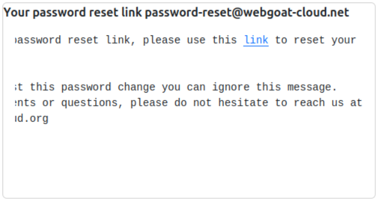

# Identification and Authenication

## Présentation

### Description

Les Identification & Authentication Failures regroupent les erreurs qui empêchent un système de vérifier correctement l’identité d’un utilisateur ou de gérer en toute sécurité l’authentification et les sessions. Cela inclut par exemple, la possibilité de faire des attaques par force brute, des réinitialisations de mots de passe fragiles, des mots de passe faibles ou hashés faiblement, ou encore une mauvaise utilisation des id de sessions.

## Quelques statistiques

D'après l’OWASP Top-10 2021, la catégorie "Identification and Authentication Failures" qui était nommée précédemment "Broken Authentication" est descendue de la 2<sup>nde</sup> à la 7<sup>ème</sup> place. Cette catégorie de vulnérabilités a été testée sur 80 % des applications étudiées, avec ~132 occurrences détectées et des taux d’incidence moyens d'environ 2.5 %. 

## Exemples d'utilisation


### 1. Changer le mot de passe d'un autre compte

Notre but est de prendre le contrôle du compte de ```tom@webgoat-cloud.org```.


On va d'abord regarder à quoi ressemble une demande de reset de mot de passe.




Et le lien est : ```http://127.0.0.1:8080/webGoat/PasswordReset/reset/reset-password/24f694ba-43ae-4229-84ef-13beb3c6471d```.

On va passer par un proxy (nous utilisons Burp Suite) pour modifier la requête avant qu'elle n'arrive au serveur.


Ici nous avons modifié le Host vers notre propre serveur de mail afin que nous recevions son mail à sa place. Voici ce que nous avons reçu :


On a reçu l'url de reset de mot de passe de son compte. Après avoir choisi son nouveau mot de passe, nous avons maintenant accès à son compte.


### 2. Usurper l'identité de quelqu'un (l'admin)

Ici nous allons nous faire passer pour quelqu'un d'autre. Il est possible de choisir notre cible en se connectant juste après la personne que l'on veut usurper. 


Ici le site nous propose de générer facilement des IDs, mais sur d'autres site, un ID est lié à un compte et si on se connecte avec un certain ID, le site nous considère comme la personne lié à l'ID.

Ici on va générer quelques IDs pour essayer de trouver un paterne. On trouve un Cookie nommé dvwaSession qui vaut successivement : ```c4ca4238a0b923820dcc509a6f75849b```
```c81e728d9d4c2f636f067f89cc14862c```
```eccbc87e4b5ce2fe28308fd9f2a7baf3```
```a87ff679a2f3e71d9181a67b7542122c```

Ces valeurs ressemblent à des hashs MD5, essayons de décrypter.


On remarque qu'il s'agit simplement d'une incrémentation. Donc si on se connecte juste avant ou après l'admin, on peut connaître son ID, puis à l'aide d'un proxy, en utilisant la même méthode que précédemment en modifiant la requête avant qu'elle ne soit vraiment envoyée pour modifier les Cookies. Ainsi le site pense que nous sommes l'admin.


## Comment se défendre de ces attaques ?

### Changer le mot de passe d'un autre compte

#### Avant

Voici le code existant :
```java
@PostMapping("/reset-password-request")
public ResponseEntity<?> resetPasswordRequest(@RequestParam String email) {
    User user = userRepository.findByEmail(email);
    if (user != null) {
        String token = UUID.randomUUID().toString();
        passwordResetTokenRepository.save(new PasswordResetToken(token, user));

        String resetUrl = "http://localhost:8080/reset?token=" + token;
        // Envoi du mail
        emailService.sendEmail(email, "Password Reset", resetUrl);
    }
    return ResponseEntity.ok("If the email exists, a reset link has been sent.");
}
```

Le problème vient du fait quel’application fait confiance à l’email fourni dans la requête, sans vérifier s’il correspond réellement à un utilisateur authentifié ou sans filtrer l’origine de la requête. Cela permet à un attaquant d’intercepter ou rediriger l’e-mail.

#### Après correction

```java
@PostMapping("/reset-password-request")
public ResponseEntity<?> resetPasswordRequest(@RequestParam String email) {
    User user = userRepository.findByEmail(email);
    if (user != null) {
        String token = UUID.randomUUID().toString();
        passwordResetTokenRepository.save(new PasswordResetToken(token, user));

        // On utilise uniquement l'email connu en BDD, sans permettre à l'utilisateur de changer de domaine, etc.
        String resetUrl = ServletUriComponentsBuilder.fromCurrentContextPath()
            .path("/reset-password")
            .queryParam("token", token)
            .build()
            .toUriString();

        emailService.sendEmail(user.getEmail(), "Password Reset", resetUrl);
    }
    // Toujours retourner la même réponse, qu'un compte existe ou non.
    return ResponseEntity.ok("If the email exists, a reset link has been sent.");
}
```

Dans la version corrigée, l'application ne fait plus confiance à l'e-mail fourni par l'utilisateur. Elle utilise uniquement l'adresse e-mail enregistrée dans sa propre base de données. Cela empêche un attaquant de modifier l'adresse pour recevoir le lien à la place de la victime. De plus, le lien de réinitialisation est généré automatiquement par le serveur, sans que l'utilisateur puisse changer le nom de domaine ou l'adresse de destination. Le token envoyé est unique et aléatoire, donc difficile à deviner. Enfin, la réponse affichée est toujours la même, que l’e-mail existe ou non. Cela évite qu’un pirate puisse deviner si un compte existe, juste en testant des adresses.

### Usurper l'identité avec un SessionID

#### Avant

Voici le code au départ, on retrouve bien qu'il s'agit d'une incrémentation suivie d'un hash MD5, ce qui est facilement reconnaissable. On peut facilement deviner les autres SessionID

```php
$cookie_value = md5($_SESSION['last_session_id_high']);
	setcookie("dvwaSession", $cookie_value, time()+3600, "/vulnerabilities/weak_id/", $_SERVER['HTTP_HOST'], false, false);
```

#### Après correction

Voici un code pour avoir un SessionID impossible à deviner
```php
$cookie_value = sha1(mt_rand() . time() . "Impossible");
	setcookie("dvwaSession", $cookie_value, time()+3600, "/vulnerabilities/weak_id/", $_SERVER['HTTP_HOST'], true, true);
```

Ici le chiffrement se fait en SHA1 qui est bien supérieur au MD5. En plus, il ne s'agit plus d'une incrémentation simple mais il y a de l'aléatoire et du temps, donc c'est impossible de deviner ce qui sera de toute manière sera chiffré.


