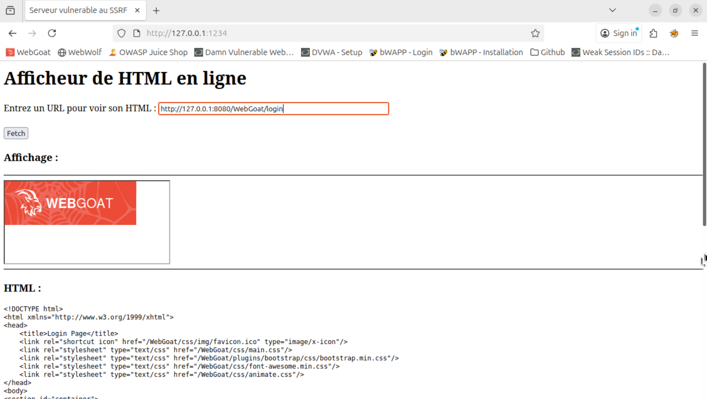
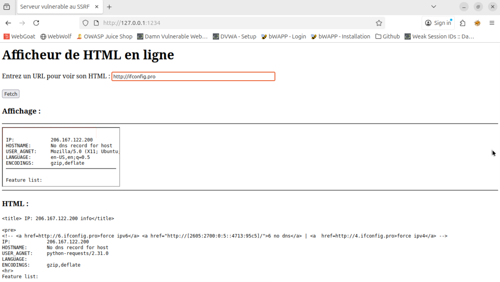
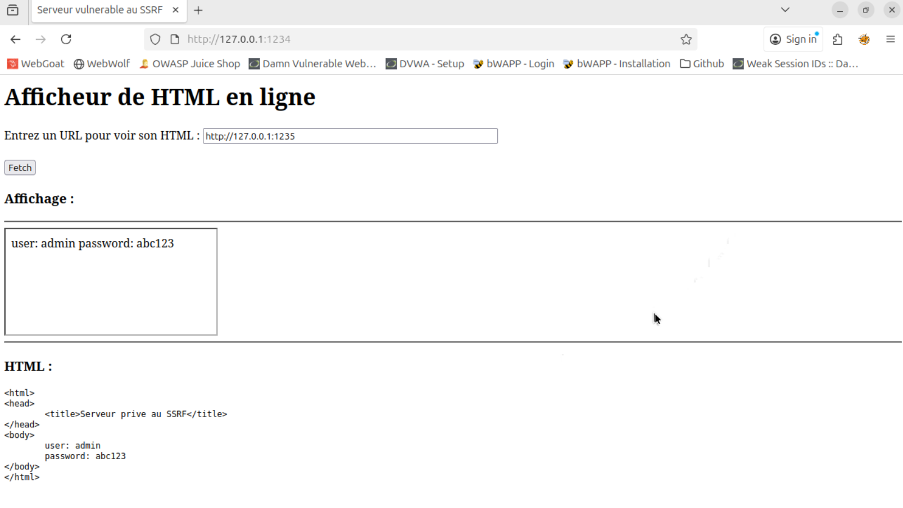
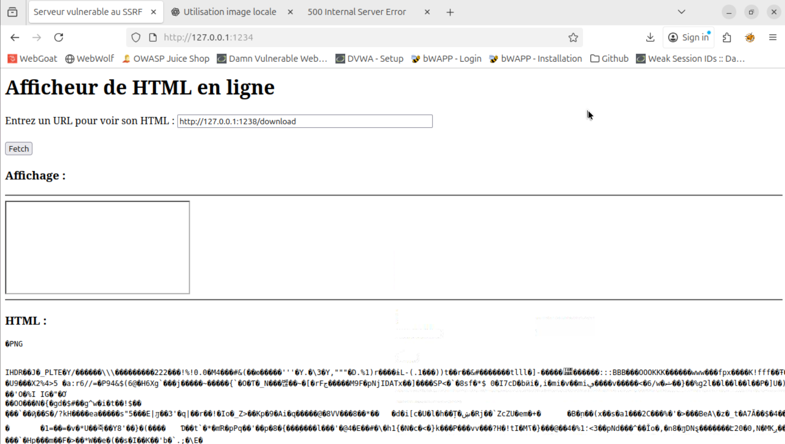
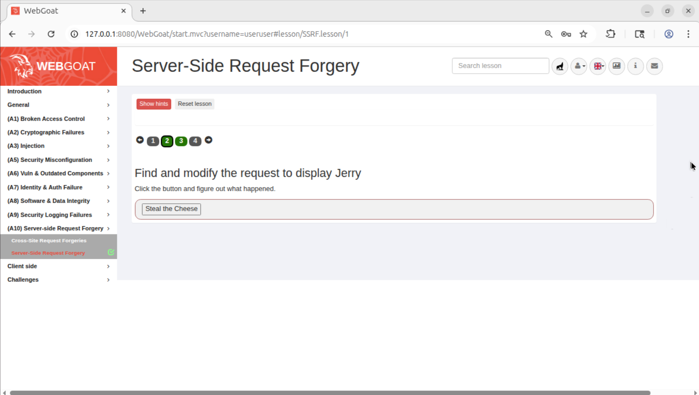
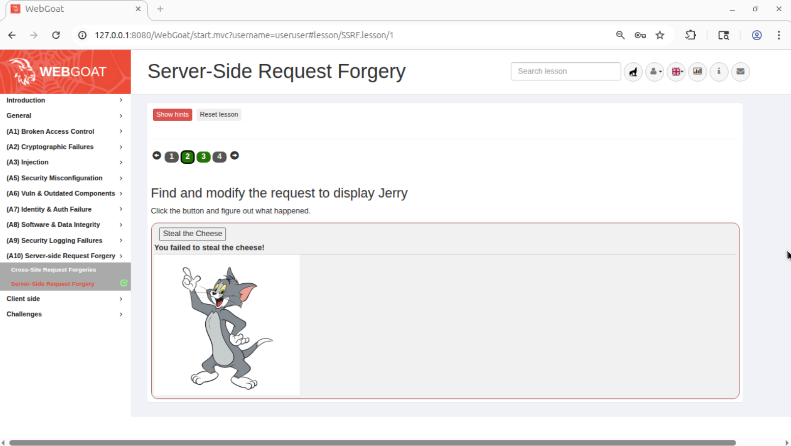
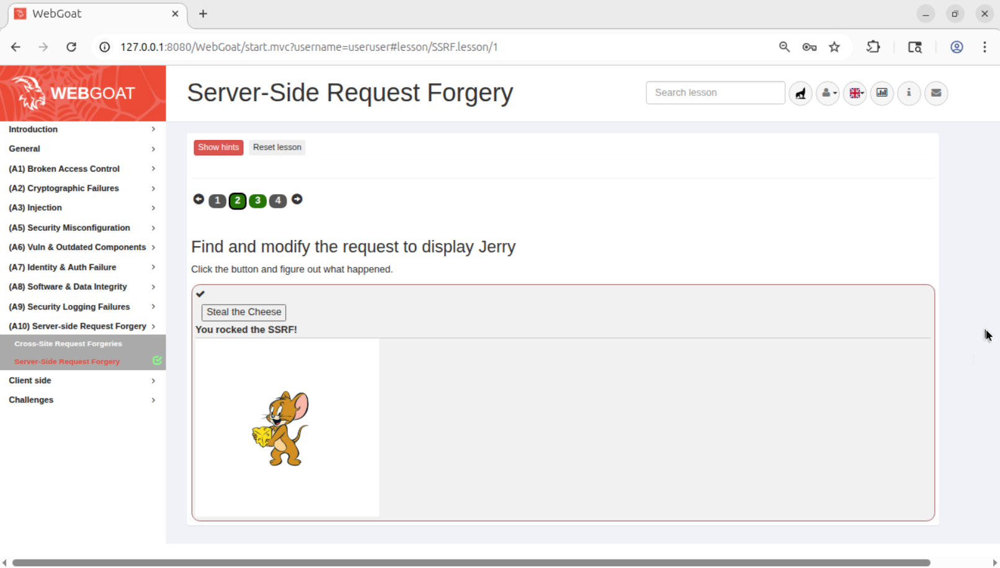

# Server Side Request Forgery

## Présentation

### Description

La SSRF (Server-Side Request Forgery) se produit lorsqu’une application web récupère des ressources distantes en se basant sur une URL fournie par l’utilisateur, sans valider correctement cette URL. L’application agit alors comme un proxy et peut être forcée à effectuer des requêtes vers des ressources internes ou externes que l’attaquant ne pourrait pas contacter directement.
Ces attaques permettent des accès non autorisé à des services internes (API privées, métadonnées cloud, bases de données administratives), ou encore des exfiltration d’informations.

## Quelques statistiques

D'après l’OWASP Top-10 2021, la catégorie "Server Side Request Forgery" a été testée sur 67.72 % des applications étudiées, avec ~9500 occurrences détectées et des taux d’incidence moyens d'environ 2.72 %. 

## Exemples d'utilisation

### 1. Accès à des ressources privées et utilisation comme proxy
 html viewer mais il a accès au réseau et si on connait l'url, on peut accéder à des ressources privées

Le site suivant permet d'afficher le code HTML et donne un aperçu du site.



Ici on peut utiliser le site comme un proxy qui va exécuter pour nous les injections ou autres attaques sur un autre site. Dans l'exemple précédent, on pouvait attaquer WebGoat.

Mais il est aussi possible d'attaquer le site lui-même ou des sites privés situés sur son réseau auquel il fait parti. On va par exemple regarder les informations réseau du site en allant sur ```http://ifconfig.pro```. Il est aussi possible d'utiliser ```file://``` pour accéder à une ressource situé sur le serveur.



Avec ces informations on peut chercher d'autres cibles sur le réseau privé puis les attaquer par le site de liseur html. Cela peut permettre de récupérer des informations qui était pourtant protégées.



Enfin, il est aussi possible de viser le site lui-même en téléchargeant notre propre malware.




### 2. Récupération de données non publiques

Ici on est sur un site qui effectue une action en fonction de notre rôle.



Normalement l'utilisateur lambda devrait recevoir une image de Tom.



Cependant, s'il on utilise un proxy (ici on utilise Burp), on remarque que l'on peut modifier l'url demandé qui vise l'image de Tom.


Si l'on sait ce que l'admin devrait avoir, on peut changer l'URL dans le proxy avant l'envoi pour se faire passer pour l'admin, au moins pour cette action. Ici on suppose que l'admin devrait voir Jerry, on va donc essayer.



On reçoit bien ce que seul l'admin devrait recevoir.


## Comment se défendre de ces attaques ?

### Accès à des ressources privées et utilisation comme proxy

#### Avant

Voici le code originel
```python
from flask import Flask, request, render_template
import requests

app = Flask(__name__)

@app.route('/',methods=['GET','POST'])
def index():
    url = ''
    if request.method == 'POST':
        url = request.form.get('url')
        r = requests.get(url, timeout=5)
        html = r.text
    return render_template('index.html', url=url,html=html)

if __name__=='__main__':
	app.run(host='0.0.0.0',port=1234)
```

#### Après correction

```python
from flask import Flask, request, render_template
import requests
from urllib.parse import urlparse
import socket
import ipaddress

app = Flask(__name__)

# Fonction de sécurité SSRF
def is_url_safe(url):
    try:
        parsed = urlparse(url)

        if parsed.scheme not in ['http', 'https']:
            return False

        hostname = parsed.hostname

        ip = socket.gethostbyname(hostname)
        ip_obj = ipaddress.ip_address(ip)

        if (
            ip_obj.is_private or
            ip_obj.is_loopback or
            ip_obj.is_reserved or
            ip_obj.is_link_local or
            ip_obj.is_multicast
        ):
            return False

        return True
    except Exception:
        return False

@app.route('/', methods=['GET', 'POST'])
def index():
    url = ''
    html = ''
    if request.method == 'POST':
        url = request.form.get('url')

        if not is_url_safe(url):
            html = 'URL refusée'
        else:
            try:
                response = requests.get(url, timeout=5, allow_redirects=False)
                html = response.text
            except Exception as e:qzdqzdqzdqzd
                html = "Erreur"

    return render_template('index.html', url=url, html=html)

if __name__ == '__main__':
    app.run(host='0.0.0.0', port=1234)
```

Le code est sécurisé contre les attaques SSRF car il implémente plusieurs mécanismes de défense complémentaires. D'abord, il vérifie que l’URL fournie utilise uniquement les schémas HTTP ou HTTPS, ce qui empêche l’exploitation ```file://``` ou autre. Ensuite, il effectue une résolution DNS du nom de domaine pour identifier l’adresse IP réelle de la cible pour vérifier qu'il ne s'agit pas du réseau privé. Ainsi il ne peut pas y avoir de fuite de données. De plus, il impose un délai d’attente strict pour éviter que le serveur ne soit paralysé par une requête malveillante lente, et il désactive le suivi des redirections HTTP, ce qui empêche les attaques indirectes via des chaînes de redirection. Enfin, il gère proprement les erreurs et affiche des messages clairs sans divulguer d’informations sensibles.

### Récupération de données non publiques

#### Avant

Voici le code originel : 

```java
protected AttackResult stealTheCheese(String url) {
    try {
      StringBuilder html = new StringBuilder();

      if (url.matches("images/tom\\.png")) {
        html.append(
            "");
        return failed(this).feedback("ssrf.tom").output(html.toString()).build();
      } else if (url.matches("images/jerry\\.png")) {
        html.append(
            "");
        return success(this).feedback("ssrf.success").output(html.toString()).build();
      } else {
        html.append("");
        return failed(this).feedback("ssrf.failure").output(html.toString()).build();
      }
    } catch (Exception e) {
      e.printStackTrace();
      return failed(this).output(e.getMessage()).build();
    }
  }
```

Ce morceau est exécuté et prend l'url envoyé par l'utilisateur.

#### Après correction

```java
protected AttackResult stealTheCheese(String url) {
    try {
        // Normaliser et contrôler l'entrée
        if (url == null) {
            return failed(this).feedback("ssrf.failure").output("Invalid resource").build();
        }

        // décodage basique et normalisation (évite encodages malicieux)
        String decoded = java.net.URLDecoder.decode(url, java.nio.charset.StandardCharsets.UTF_8.name()).trim();

        // Rejet rapide de patterns dangereux
        String lower = decoded.toLowerCase();
        if (lower.contains("..") || lower.startsWith("/") || lower.contains("://") || lower.contains("\\") || lower.contains(":")) {
            // log attempt ou audit
            System.out.println("Blocked SSRF attempt: " + decoded);
            return failed(this).feedback("ssrf.failure").output("Resource not allowed").build();
        }

        // Map des ressources autorisées (clé simple -> chemin interne sécurisé)
        Map<String, String> allowed = new HashMap<>();
        allowed.put("tom", "images/tom.png");
        allowed.put("jerry", "images/jerry.png");
        // si besoin ajouter d'autres images sûres explicitement

        // On accepte soit la clé (tom / jerry) soit le chemin exact autorisé
        String resource = null;
        if (allowed.containsKey(decoded)) {
            resource = allowed.get(decoded);
        } else {
            // autoriser l'utilisation des chemins exacts figurant dans la whitelist
            for (String path : allowed.values()) {
                if (path.equals(decoded)) {
                    resource = path;
                    break;
                }
            }
        }

        if (resource == null) {
            // tentative d'accès à une ressource non whitelistée
            System.out.println("Blocked resource request: " + decoded);
            return failed(this).feedback("ssrf.failure").output("").build();
        }

        // Construire la sortie en pointant vers la ressource interne autorisée
        StringBuilder html = new StringBuilder();
        if ("images/tom.png".equals(resource)) {
            html.append("");
            return failed(this).feedback("ssrf.tom").output(html.toString()).build();
        } else if ("images/jerry.png".equals(resource)) {
            html.append("");
            return success(this).feedback("ssrf.success").output(html.toString()).build();
        } else {
            html.append("");
            return failed(this).feedback("ssrf.failure").output(html.toString()).build();
        }

    } catch (Exception e) {
        e.printStackTrace();
        return failed(this).output(e.getMessage()).build();
    }
}
```

De la même manière que sur l'exemple précédent, on vérifie le schéma de l’URL, on bloque les IP internes après résolution DNS, on désactive les redirections, on impose un timeout, et on gère proprement les erreurs. Ces protections empêchent l’accès aux ressources internes et bloquent les vecteurs classiques de SSRF.